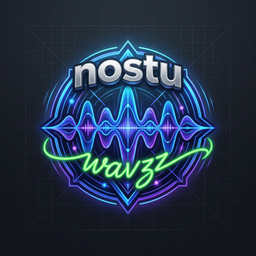

<p align="center">
  
</p>

<h1 align="center">Nostu Wavzz</h1>

<p align="center">
  <strong>Rediscover the magic of radio.</strong><br />
  50,000+ live stations from every corner of the planet, streaming freely.<br />
  No account. No ads. Just you and the dial.
</p>

<p align="center">
  <a href="https://github.com/sreyassanker/nostuwavzz/releases">
    
  </a>
  <a href="#license">
    
  </a>
  <a href="https://github.com/sreyassanker">
    
  </a>
</p>

---

## What is Nostu Wavzz?

Nostu Wavzz is a free, open-source internet radio player that brings back the nostalgia of radio — that feeling of tuning in to a distant city, discovering a new station, and letting the music carry you away.

Built with **Tauri v2**, **React 19**, **TypeScript**, and **Rust** — fast, lightweight, and cross-platform: **Windows, macOS, Linux, and Android**.

---

## Demo

<p align="center">
  <a href="https://www.youtube.com/watch?v=Gf_LIFhkxWg">
    
  </a>
</p>

---

## Features

### Discovery
- **50,000+ stations** — full index sourced from the community-run [radio-browser.info](https://radio-browser.info) directory
- **Interactive 3D Globe** — stations plotted by real coordinates; tap a dot to listen instantly
- **Full-text search** — press `Ctrl+K` / `Cmd+K` anywhere, search by name, country, genre, or language
- **Smart filters** — filter by continent, country, tag/genre, or favorites
- **Top charts** — stations ordered by real click-count popularity

### Playback
- **Bottom-sheet player** — a persistent mini pill that expands into a full player; swipe left/right to skip between stations, spin the artwork ring while playing
- **Lock-screen & notification controls** — native Android media notification with play/pause/next/previous, artwork, and hardware-button support
- **Audio focus** — playback pauses automatically when a call or another app takes audio, and resumes when you regain focus
- **Auto-resume on reconnect** — plug your headphones or reconnect your Bluetooth earbuds and playback picks right back up
- **Crossfade** — optional smooth volume crossfade (0.5–3s, adjustable) when switching stations
- **Stall recovery** — automatically retries flaky streams (3 attempts) and reconnects
- **Buffering indicator** — an inline "Buffering…" banner appears in the player when a stream stalls
- **Sleep timer** — 15 / 30 / 60 / 90 min, gently fades the volume out before stopping, and survives an app restart
- Volume slider + mute
- Resume your last station on launch

### Data & Performance
- **Offline-first** — full station catalog cached locally (IndexedDB in browser, SQLite FTS5 on desktop/Android)
- **Background sync** — catalog refreshes automatically every 24h
- **Web Worker filtering** — search & filter run off the main thread; the UI never stutters, even with 50K rows
- **Virtualized grid** — smooth scrolling through thousands of station cards
- **Favicon cache** — station logos stored locally with 7-day TTL + LRU eviction
- **Data saver mode** — skip station-logo downloads on cellular connections
- **Favorites** — one-tap heart, persisted across sessions

### Experience & Polish
- **Dynamic accent from station art** — the app colors itself with the dominant color of the currently playing station's artwork
- **Pure black (AMOLED) mode** — deep-black backgrounds for OLED screens in dark mode
- **Recently played** — a one-tap row of your latest stations right on the home screen
- **Shimmer skeletons** — smooth loading placeholders while the station catalog syncs
- **Searchable settings** — find any setting instantly; grouped list-cards with a compact / normal / cozy density scale
- **Light & dark themes** — follow your system, or pick manually

### Privacy
- No accounts, no tracking, no ads
- All data stays on your device
- Streams connect directly to each station's server — audio is never proxied

---

## Tech Stack

| Layer | Technology |
|---|---|
| App shell | [Tauri v2](https://v2.tauri.app) (Rust + system WebView) |
| Native media controls | `tauri-plugin-media-session` (Android/iOS lockscreen & notification) |
| UI | [React 19](https://react.dev) + TypeScript (strict) |
| Styling | [Tailwind CSS v4](https://tailwindcss.com) + hand-tuned CSS variables |
| 3D globe | [react-globe.gl](https://github.com/vasturiano/react-globe.gl) (Three.js / WebGL) |
| State | [Zustand](https://zustand.docs.pmnd.rs) |
| Offline DB (native) | SQLite via [rusqlite](https://github.com/rusqlite/rusqlite) with FTS5 full-text index |
| Offline cache (web) | [IndexedDB](https://developer.mozilla.org/docs/Web/API/IndexedDB_API) via `idb` |
| Async runtime | [Tokio](https://tokio.rs) |
| Build | [Vite 8](https://vite.dev) |

---

## Project Structure

```
NostuWavzz/
├── index.html                 # Web entry point
├── package.json               # npm scripts & dependencies
├── vite.config.ts             # Vite + Tailwind + React plugins
├── tsconfig.json
│
├── src/                       # React frontend
│   ├── main.tsx               # React bootstrap
│   ├── App.tsx                # Root: boot, filtering, player logic
│   ├── index.css              # Global styles (Tailwind + design tokens)
│   │
│   ├── components/
│   │   ├── Header.tsx         # Logo, sync status, favorites, theme toggle
│   │   ├── FilterBar.tsx      # Search box, continent/tag chips, country select
│   │   ├── StationGrid.tsx    # Virtualized card grid + skeleton loading
│   │   ├── StationCard.tsx    # Single station card
│   │   ├── RecentRow.tsx      # "Recently played" home row
│   │   ├── StationLogo.tsx    # Lazy favicon with data-saver support
│   │   ├── GlobeView.tsx      # 3D globe, tooltips, now-playing marker
│   │   ├── PlayerSheet.tsx    # Bottom-sheet player: mini pill + full player, swipe-to-switch
│   │   ├── MobileTabBar.tsx   # Mobile bottom navigation
│   │   ├── SearchModal.tsx    # ⌘K quick-search overlay
│   │   ├── StationInfoModal.tsx  # Station detail dialog
│   │   ├── SettingsView.tsx   # Searchable settings (theme, density, crossfade, data)
│   │   └── Toast.tsx          # Notification toasts
│   │
│   ├── lib/
│   │   ├── api.ts             # radio-browser.info client, normalizers, continent mapping
│   │   ├── fetchStations.ts   # Batch downloader (4 mirrors, 1K/batch, ≤50K)
│   │   ├── filter.ts          # Shared filter logic (used by worker + main thread)
│   │   ├── audioEngine.ts     # Audio engine: configurable crossfade, fade-out, stall recovery, media session
│   │   ├── mediaSession.ts    # Native Android media-session bridge (tauri-plugin)
│   │   ├── colorExtract.ts    # Dominant-color extraction from station artwork (accent theme)
│   │   ├── stationCache.ts    # IndexedDB station persistence
│   │   ├── imageCache.ts      # IndexedDB favicon cache (LRU, 7-day TTL)
│   │   ├── storage.ts         # localStorage helpers (favorites, last-played)
│   │   ├── tauriApi.ts        # Tauri IPC wrapper + browser fallback
│   │   ├── useSleepTimer.ts   # Sleep timer hook (fades out, survives restarts)
│   │   ├── useTheme.ts        # Light/dark/accent theme hook
│   │   ├── useMediaQuery.ts   # Responsive media-query hook
│   │   └── utils.ts           # escapeHtml, flags, highlight helpers
│   │
│   ├── store/store.ts         # Zustand global store
│   ├── types/index.ts         # Shared TypeScript types
│   └── workers/filter.worker.ts  # Off-main-thread filtering
│
├── src-tauri/                 # Rust backend
│   ├── Cargo.toml
│   ├── tauri.conf.json        # App identity, window, CSP, bundle
│   ├── build.rs
│   ├── capabilities/default.json
│   ├── icons/                 # App icons (all platforms)
│   └── src/
│       ├── main.rs            # Entry point
│       └── lib.rs             # SQLite + FTS5, 11 Tauri commands, daily auto-sync
│
└── docs/                      # Landing page
    └── index.html             # Professional marketing site
```

---

## Getting Started

### Prerequisites

| Tool | Version | Purpose |
|---|---|---|
| [Node.js](https://nodejs.org) | ≥ 20 | Frontend toolchain |
| [Rust](https://rustup.rs) | stable (≥ 1.77) | Tauri backend |
| Tauri CLI | `npm i -D @tauri-apps/cli` v2 | Build & dev commands |

### Run in Browser

```bash
npm install
npm run dev
# → http://localhost:5173
```

### Run as Desktop App

```bash
npm install
npm run tauri dev
```

---

## Building

### Desktop — Windows / macOS / Linux

```bash
npm run tauri build
```

Bundles land in `src-tauri/target/release/bundle/`:
- Windows → `.msi`, `.exe` (NSIS)
- macOS → `.app`, `.dmg`
- Linux → `.AppImage`, `.deb`

### Android

One-time setup:

```bash
# Rust Android targets
rustup target add aarch64-linux-android armv7-linux-androideabi x86_64-linux-android

# Set environment variables
export ANDROID_HOME="$HOME/Android/Sdk"
export NDK_HOME="$ANDROID_HOME/ndk/<version>"

# Generate the Android project
npm run tauri android init
```

Build APK:

```bash
# Release APK (arm64), signed with the release keystore
npx tauri android build --target aarch64
```

The signed APK lands in `src-tauri/gen/android/app/build/outputs/apk/universal/release/`.

> **Target SDK:** 36 (Android 16) | **Min SDK:** 24 (Android 7.0)
>
> **Notes:**
> - Windows requires Developer Mode enabled for the symlink step during Android builds.
> - The release build allows cleartext (`http://`) audio, since many radio streams aren't HTTPS yet.
> - Android 13+ will ask for notification permission on first play — this powers the lock-screen media controls.
> - `tauri-plugin-media-session` is patched (in the Cargo registry copy, pinned to 0.2.4) to auto-resume playback when Bluetooth or headphones reconnect.

---

## Configuration

| File | Description |
|---|---|
| `src-tauri/tauri.conf.json` | App id, window size, CSP, bundle icons |
| `src/index.css` | Design tokens (colors, shadows, radii) |
| `src/lib/fetchStations.ts` | Mirror list, batch size, station cap |

---

## Keyboard Shortcuts

| Key | Action |
|---|---|
| `Ctrl / Cmd + K` | Open quick search |
| `Esc` | Close dialogs |
| `Space` | Play / pause |
| `←` / `→` | Previous / next station |

---

## Support the Author

If you enjoy Nostu Wavzz, consider supporting the author! Your support helps keep the project alive and growing.

<p align="center">
  <a href="upi://pay?pa=YOUR_UPI_ID&pn=Sreyas&cu=INR">
    
  </a>
</p>

---

## License

[MIT](LICENSE) — Copyright © 2026 Nostu Wavzz

Station metadata © [radio-browser.info](https://www.radio-browser.info) contributors (open data).  
Audio streams © their respective broadcasters.
